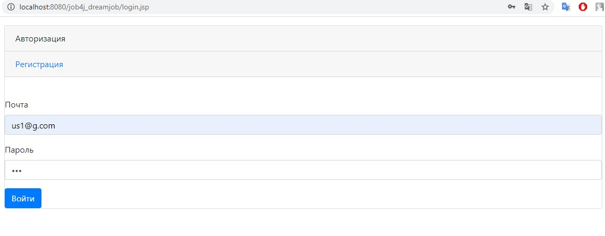
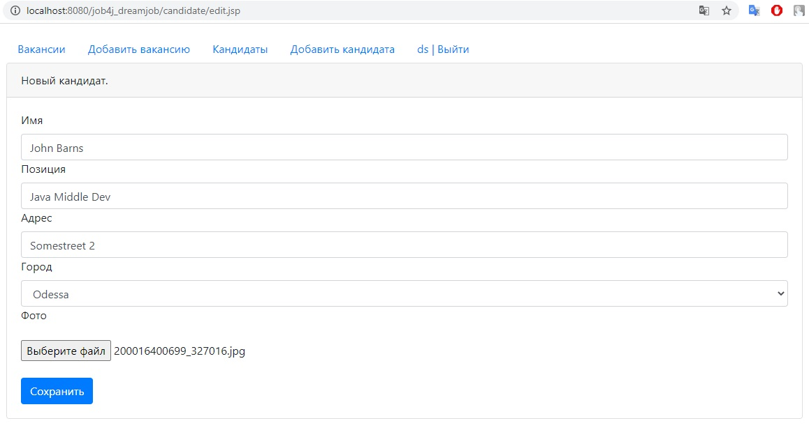
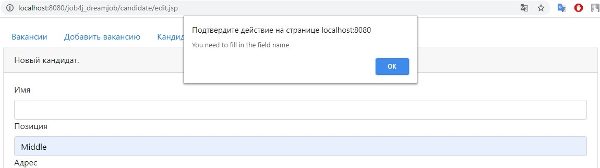
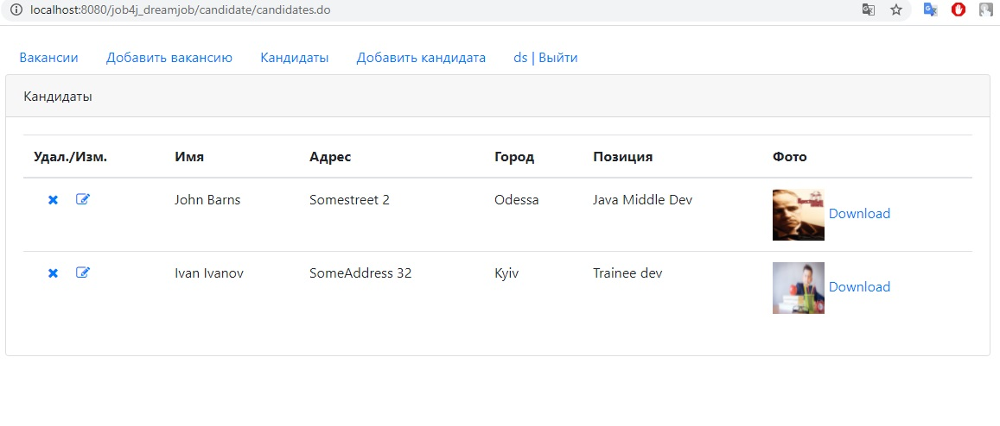

## Project "DreamJob"

This project has implemented an example of a simple web application for working with vacancies and candidates.

Used technologies:
- Apache Tomcat
- PostgresSQL
- Liquibase library for DB
- JS,AJAX,JSP (front)
- Logging system Slf4j with log4j
- Mockito with PowerMock for test cases
- Maven as a build system

Login page - the application implements registration and authentication of 
application users. All pages can only be viewed by authorized users.

The page for adding/editing a candidate with field validation

Candidates Page - Shows a list of candidates. On the left there is
 an icon for editing data and an icon for deleting a candidate 
 from the database. On the right is a link to download a photo

